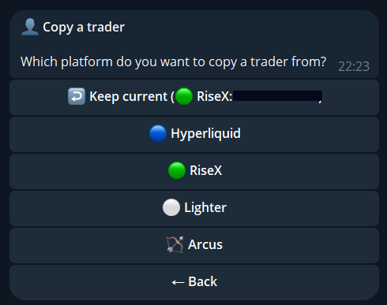
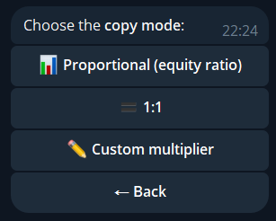
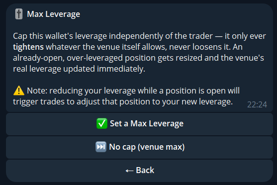
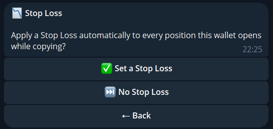
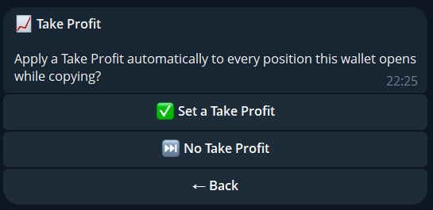
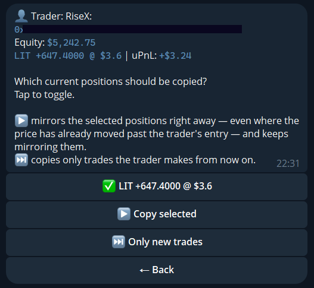

import { Steps, Aside } from '@astrojs/starlight/components';

Mimiq compares the trader's position with yours and trades the difference. It does not copy fills one by one.

## Set up

Tap `👤 Set Trader` (`👤 Change Trader` if one is set).

<Steps>

1. **Platform.** Pick where the trader trades. Hyperliquid, Lighter, RiseX and Arcus can be copied.

   

2. **Trader.** Send the wallet address (`0x…`). On Lighter you can send the account index or the wallet address. If the address has several accounts, pick one.
3. **Mode.** `Proportional`, `1:1` or `Custom` (your own multiplier, for example `2` or `0.5`).

   

4. **Max leverage (optional).** A ceiling for this wallet. It only tightens what the venue allows, never loosens it.

   

5. **Stop-loss and take-profit (optional).** Applied automatically to every position the wallet opens, as a percentage or a dollar amount. Only offered where the venue supports native SL/TP.

   

   

6. **Current positions.** Copy the trader's open positions now, or only trades from now on. You can deselect single positions.

   

</Steps>

Then confirm. Copying starts within about 30 seconds.

## Sizing

| Mode | Size |
|---|---|
| Proportional | In proportion to your account size |
| 1:1 | The same size as the trader |
| Custom | The trader's size times your multiplier |

Trades below 10 USD are skipped (1 USD on RiseX, Hibachi and Extended). A single copy trade above 500,000 USD is rejected.

## Current positions or new trades only

<Aside>
**Copy current** mirrors the trader's existing book right away, even where the price has moved past their entry, and keeps mirroring everything. **New trades only** copies what the trader does from now on. If the price has moved since the entry, the bot warns you first.
</Aside>

## Start and stop

`▶️ Start copying` and `⏹ Stop copying` are in the menu. When you stop with open positions, you choose:

| Option | Result |
|---|---|
| `🔴 Close all & stop` | Closes every position, then stops |
| `🎯 Choose which to close` | Opens your positions to pick |
| `⏸ Keep positions & stop` | Stops copying, leaves the positions open |

<Aside type="note">
Change mode, leverage cap, notifications and names later under [Settings](/guide/main-menu/#settings).
</Aside>
