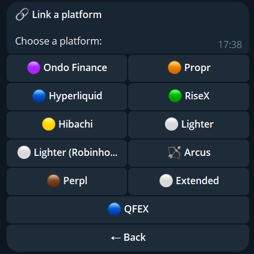
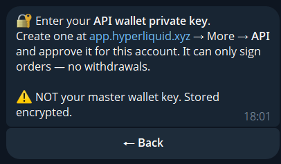
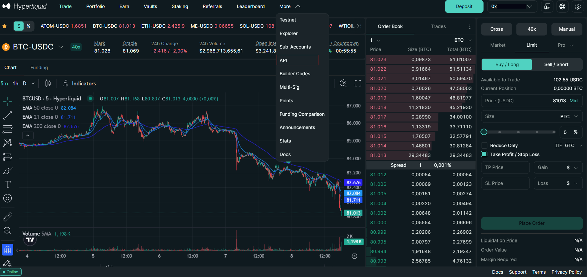
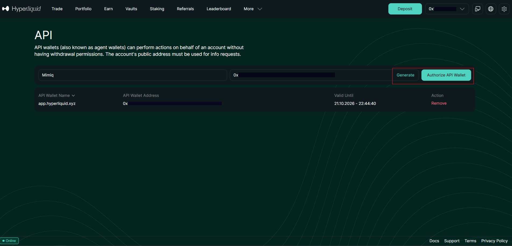
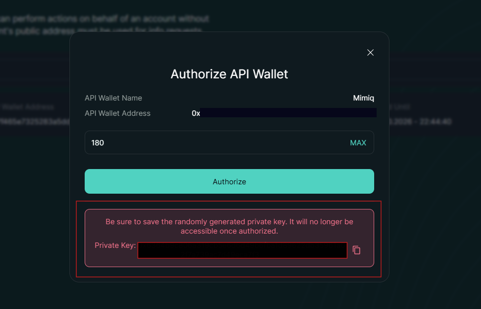
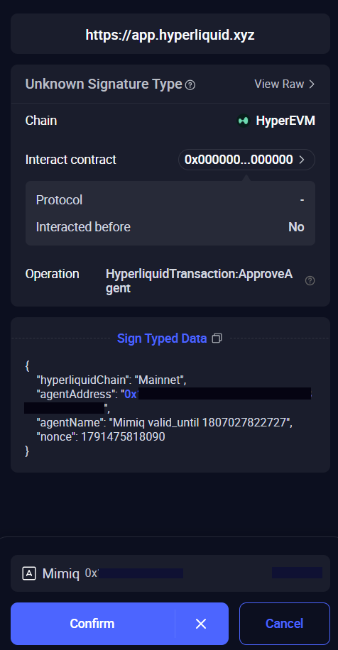
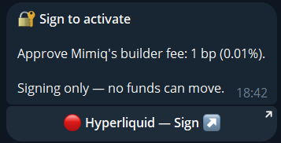
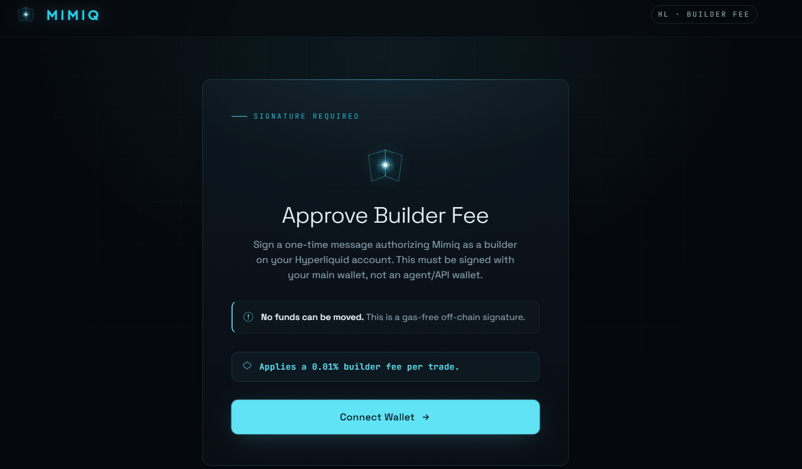

import { Steps, Aside } from '@astrojs/starlight/components';

This walkthrough shows every screen you meet when you link a venue, using **Hyperliquid** as the example. Mimiq never receives your main wallet key. You give it an API key that can trade but cannot withdraw. More on that in [Security and your keys](/security/).

Every venue follows the same path: pick it in the bot, create a key on the venue's side, send it to the bot, and where needed sign the fee approval once. Steps 1, 7 and 9 are the same everywhere. Steps 2 to 6 and 8 are the Hyperliquid details. On every other venue the bot tells you at that step what it needs and where to create it.

**You need (for the example):** a Hyperliquid account that you can open on app.hyperliquid.xyz with the wallet that owns it, and the Mimiq bot open in Telegram.

<Steps>

1. **Choose the venue.** In the bot tap `🔗 Link platform`, then `Hyperliquid`.

   

2. **The bot asks for an API wallet key.** Leave this chat open and switch to Hyperliquid. The bot tells you where to create the key, that it can only sign orders, and that it is not your master wallet key.

   

3. **Open the API page on Hyperliquid.** On app.hyperliquid.xyz open `More`, then `API`.

   

4. **Name and generate the key.** Type a name, for example `Mimiq`, tap `Generate`, then `Authorize API Wallet`.

   

5. **Set the validity and authorize.** Hyperliquid asks for how many days the API wallet stays valid. The field in this screenshot shows 180, the maximum. Tap `Authorize`. Copy the **private key** shown below the button right now: Hyperliquid shows it only once.

   

6. **Confirm in your wallet.** Your wallet shows an `ApproveAgent` signature request for the API wallet's address. Confirm it. This only authorizes the API wallet on your account.

   

7. **Send the key to the bot.** Paste the private key into the chat. The bot deletes your message right away, checks the key with Hyperliquid and stores it encrypted.

8. **Approve Mimiq's fee once.** The bot sends a message with a `Hyperliquid — Sign` button. It says the signature moves no funds and that Mimiq's builder fee is 1 bp (0.01%).

   

   Tap the button. A Mimiq page opens. Connect the wallet that **owns the account**, your main wallet and not the API wallet, and sign. The signature is gas-free and off-chain.

   

9. **Done.** The bot confirms and returns to the menu. Next: [copy a trader](/guide/copy-trading/) or [open a delta-neutral pair](/guide/delta-neutral/).

</Steps>

<Aside type="caution" title="Keep the key to yourself">
The API wallet key can place orders on your account until it expires or you remove it. Send it only to the Mimiq bot, and never send your main wallet key.
</Aside>

<Aside type="note" title="Lighter and Lighter RH">
Mimiq needs a Premium or Plus account. When you link, a Standard account is switched to Premium automatically, and Lighter's trading fees apply.
</Aside>

<Aside type="note" title="When the key stops working">
If the API wallet expires or you remove it on Hyperliquid, the bot sends you a message with a button to link it again. You can also replace the key yourself under `⚙️ Settings` → `🔑 Change API Key`.
</Aside>
