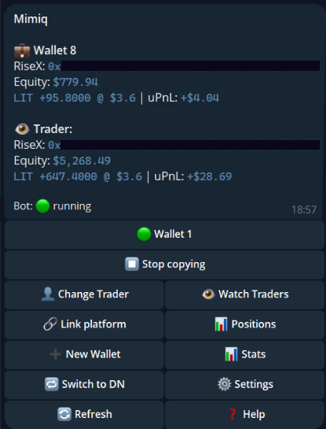
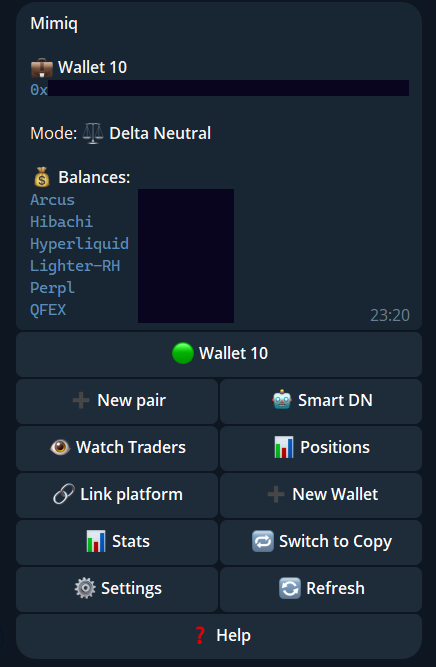

import { Aside } from '@astrojs/starlight/components';

Open the bot and send `/start`. The menu shows the status of the selected wallet and the buttons for its mode.

## Copy mode

*Addresses are hidden in this screenshot.*

More on the buttons: [Copy trading](/guide/copy-trading/), [Watch traders](/guide/watch-traders/), [Link a venue](/guide/link-venue/).

## Delta-neutral mode

*Addresses and balances are hidden in this screenshot.*

`➕ New pair` and `🤖 Smart DN` replace the trader buttons. `📊 Positions` shows your open pairs, and `🔁 Switch to Copy` changes the mode back. See [Delta-neutral](/guide/delta-neutral/) and [Smart DN plans](/guide/smart-dn/).

## Settings

`⚙️ Settings` opens:

| Button | What it does |
|---|---|
| Copy mode | `📊 Proportional (equity ratio)`, `🟰 1:1` or `✏️ Custom multiplier` |
| `🔔 Notifications` | Toggle **Fills**, **Closes** and **Errors** |
| `🔑 Change API Key` | Replace the credentials of a linked venue |
| `🔀 Switch Active Venue` | Choose which linked venue the wallet trades on |
| `✏️ Rename Wallet` | Rename the wallet |
| `✏️ Rename Trader` | Rename the copied trader |
| `⚙️ Leverage` | Set a max-leverage cap |

## Stats and history

`📊 Stats` (or `/stats`) shows total volume, total PnL, total fees and the blended cost per 1M traded, DN funding collected, and volume, cost per 1M and fees for each venue. A leading `≈` means the fee figure is partly an estimate.

`/history` lists your recent trades and the closed delta-neutral pairs with their result. `/status` shows the wallet, its mode and its trader.

## Commands

| Command | Shows |
|---|---|
| `/start` | Main menu |
| `/setup` | Link a platform |
| `/positions` | Open positions |
| `/history` | Recent trades |
| `/stats` | Volume, fees, PnL, funding |
| `/status` | Wallet and trader status |
| `/deltaneutral` | Delta Neutral menu |
| `/leavewaitlist` | Delete your waitlist entry |

<Aside>Commands act on the wallet that is selected in the menu.</Aside>
