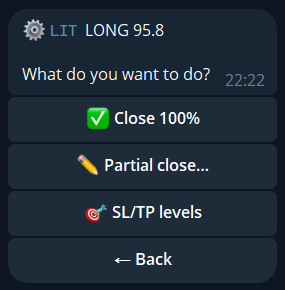

`📊 Positions` (or `/positions`) lists your open positions across the venues linked to the wallet. Open one to manage it.

## Close

| Button | Effect |
|---|---|
| `✅ Close 100%` | Closes the whole position |
| `✏️ Partial close…` | Closes a part you enter |
| `💣 Close all` | Closes every open position, after a confirmation |

## Stop-loss and take-profit

In a position, `🛑 Set SL` and `🎯 Set TP` place a stop-loss or take-profit on the venue. `❌ SL off` and `❌ TP off` remove them. A stop set here lives on the venue as a native order.

To protect every copy position automatically, set SL/TP in the [copy setup](/guide/copy-trading/). For Delta-Neutral pairs, see [Delta-Neutral](/guide/delta-neutral/).
