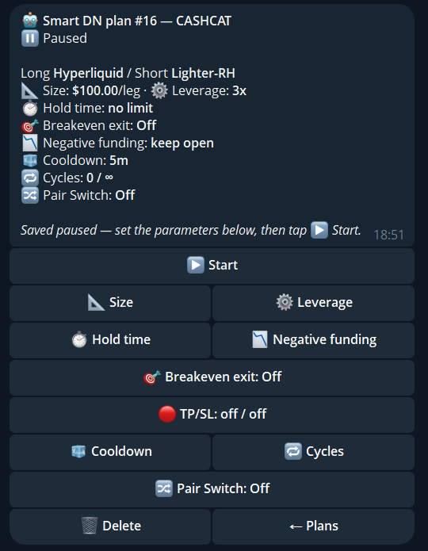

import { Steps } from '@astrojs/starlight/components';

A **plan** opens a pair on the symbol and venues you pick, holds it, closes it, waits, and repeats. The wallet must be in DN mode.

<Steps>

1. Open `🤖 Smart DN` and tap `➕ New plan`.
2. Go through the same steps as a new pair: venues, symbol, leverage, size.
3. Set the cycle options below.
4. Start it with `✅ Start now`.

</Steps>

## Cycle options

| Option | Meaning |
|---|---|
| `⏱ Hold time` | How long each pair stays open, for example `4h` or `2d` |
| `🧊 Cooldown` | Wait after each close before the next open |
| `🔁 Cycles` | Stop after this many cycles, or run without a limit |
| `📉 Negative funding` | Keep the pair open, or close it when funding turns negative |
| `🎯 Breakeven exit` | Optional exit when the pair has earned back its fees |
| `🔀 Pair Switch` | Off, manual pool, or auto with a minimum APR |
| `⚙️ Leverage`, `📐 Size` | Fixed or max leverage, and the pair size |
| `🎯 SL/TP levels` | Stops for each pair |

Each plan has `⏸ Pause`, resume and `🗑 Delete plan`.
